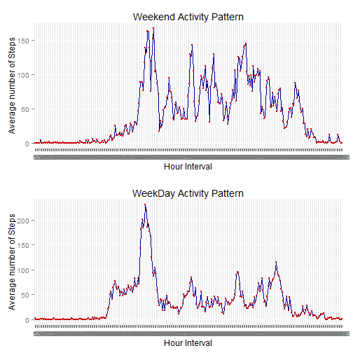

# Reproducible Research: Peer Assessment 1
========================================================


## Loading and preprocessing the data
Step 1: Read the data: 


```r
setInternet2(TRUE)
fileUrl <- "https://d396qusza40orc.cloudfront.net/repdata%2Fdata%2Factivity.zip"
download.file(fileUrl, destfile="repdata_Fdata_Factivity.zip", method="auto")
Factivity <- read.csv(unz("repdata_Fdata_Factivity.zip","activity.csv"))
unlink("activity.csv")
```

Date file download: 

```r
date
```

```
## [1] "Mon Jun 16 00:31:16 2014"
```

## What is mean total number of steps taken per day?


```r
# Histogram of the total number of steps taken each day
aggSum <- aggregate (Factivity$steps, by=list(as.factor(Factivity$date)),FUN=sum,rm.na=TRUE)
names(aggSum) <- c("date","steps")
hist(aggSum$steps,main="Steps Histogram",col="blue",xlab="Steps")
```

 

```r
# Mean and Median total number of steps taken per day
mean(aggSum$steps, na.rm=TRUE)
```

```
## [1] 10767
```

```r
median(aggSum$steps, na.rm=TRUE)
```

```
## [1] 10766
```

## What is the average daily activity pattern?


```r
## Time series plot of the 5-minute interval (x-axis) and the average number of steps taken, averaged across all days (y-axis)

avgstepinterv <- aggregate (Factivity$steps, by=list(as.factor(Factivity$interval)),FUN=mean, na.rm=TRUE)
names(avgstepinterv) <- c("interval","mean.steps")

library(ggplot2)
ggplot(avgstepinterv, aes(x=as.factor(interval), y=mean.steps))+
geom_line(aes(group=1), colour="#000099") +  # Blue lines
geom_point(size=1, colour="#CC0000") +        # Red dots
labs(x="Hour Interval")+labs(y="Average number of Steps") +
        labs(title="Daily Activity Pattern")
```

 

```r
#5-minute interval that contains the maximum number of steps on average across all the days in the dataset,     
avgstepinterv[avgstepinterv$mean.steps==max(avgstepinterv$mean.steps),]
```

```
##     interval mean.steps
## 104      835      206.2
```


## Imputing missing values


```r
# Total number of missing values in the dataset 
nrow(Factivity[is.na(Factivity$steps),])
```

```
## [1] 2304
```

```r
#Strategy for filling in all of the missing values in the dataset: 
#Use the mean for that 5-minute interval, etc.

#New dataset that is equal to the original dataset but with the missing data filled in.
total <- merge(Factivity,avgstepinterv,by="interval")
total <- total[order(total$date,total$interval),]
total$steps1 <- ifelse(is.na(total$steps),total$mean.steps,total$steps)

#Histogram of the total number of steps taken each day (replacing NA values)
aggSum1 <- aggregate (total$steps1, by=list(as.factor(Factivity$date)),FUN=sum,rm.na=TRUE)
names(aggSum1) <- c("date","steps")
hist(aggSum1$steps,main="Steps Histogram",col="blue",xlab="Steps")
```

 

```r
# Mean and Median total number of steps taken per day
mean(aggSum1$steps, na.rm=TRUE)
```

```
## [1] 10767
```

```r
median(aggSum1$steps, na.rm=TRUE)
```

```
## [1] 10767
```

These values nearly does not differ from the estimates from the first part of the assignment. Imputing missing data on the estimates of the total daily number of steps, results in higher median value.


## Are there differences in activity patterns between weekdays and weekends?


```r
# New factor variable in the dataset with two levels - "weekday" and "weekend" indicating whether a given date is a weekday or weekend day

total$wd <- ifelse(!weekdays(as.Date(total$date)) %in% c('sábado','domingo'),1,0)

total2 <- split (total,total$wd)
stweekend <- total2[[1]]
stweekend <- stweekend[,c(1,3,5)]
stweekday <- total2[[2]]
stweekday <- stweekday[,c(1,3,5)]

meanstepsweekend <- aggregate (stweekend$steps1, by=list(as.factor(stweekend$interval)),FUN=mean, na.rm=TRUE)
names(meanstepsweekend) <- c("interval","mean.steps")

meanstepsweekday <- aggregate (stweekday$steps1, by=list(as.factor(stweekday$interval)),FUN=mean, na.rm=TRUE)
names(meanstepsweekday) <- c("interval","mean.steps")

library(ggplot2)
p1 <- ggplot(meanstepsweekend, aes(x=as.factor(interval), y=mean.steps))+
geom_line(aes(group=1), colour="#000099") +  # Blue lines
geom_point(size=1, colour="#CC0000") +        # Red dots
labs(x="Hour Interval")+labs(y="Average number of Steps") +
        labs(title="Weekend Activity Pattern")

p2 <- ggplot(meanstepsweekday, aes(x=as.factor(interval), y=mean.steps))+
geom_line(aes(group=1), colour="#000099") +  # Blue lines
geom_point(size=1, colour="#CC0000") +        # Red dots
labs(x="Hour Interval")+labs(y="Average number of Steps") +
        labs(title="WeekDay Activity Pattern")

library(grid)
library(gridExtra)
grid.arrange(p1, p2)
```

 

There are difference between weekday and weekend activity pattern.
The most important difference is that during the weekend there is more activity than the weekdays.
